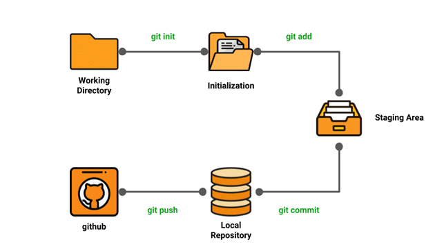

Created a file on my local workstation

Went on github and made a repo in github and copied the https link

Cloned the repo onto my local workstation using 'git clone'

Changes the README.md file using nano 

Then made the changes on local worksation

cdPushed the changes onto github